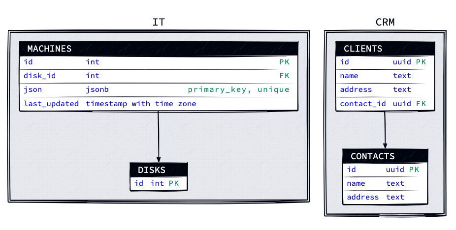

# PostgreSQL ERD
The simplest way to get all postgres tables, fields, types and relationships.

## Install
```
git clone https://github.com/nestoru/postgreSQL-ERD.git
cd postgreSQL-ERD
python -m venv myenv
source myenv/bin/activate
pip install
```

## Generate a declarative diagram (d2) file out of the database
```
export DB_HOST='' && \
export DB_NAME='' && \
export DB_USER='' && \
export DB_PASSWORD='' && \
python postgres2d2.py > schema.d2
```

## Convert the d2 file to svg
The d2 files can be converted to svg, png, pdf etc (check d2 reference for options).
Option --watch listens on a given port, opens up chrome and shows the diagram, --sketch simulates a human sketch, -t is the theme, --scale shows a size suitable for your personal device, the extension of the last token (output file) instructs the rendering format.
```
d2 --watch --sketch -t 300 --scale 0.1 schema.d2 schema.svg
```

## Sample generated d2 file
The name of each entity is composed by the schema.tableName.
```
IT.machines: {
  shape: sql_table
  id: int {constraint: primary_key}
  disk_id: int {constraint: foreign_key}

  json: jsonb  {constraint: primary_key, unique}
  last_updated: timestamp with time zone
}

IT.disks: {
  shape: sql_table
  id: int {constraint: primary_key}
}

CRM.clients: {
  shape: sql_table
  id: uuid {constraint: primary_key}
  name: text
  address: text
  contact_id: uuid {constraint: foreign_key}
}

CRM.contacts: {
  shape: sql_table
  id: uuid {constraint: primary_key}
  name: text
  address: text
}

IT.machines.disk_id -> IT.disks.id
CRM.clients.contact_id -> CRM.contacts.id
```

## Sample generated diagram (

